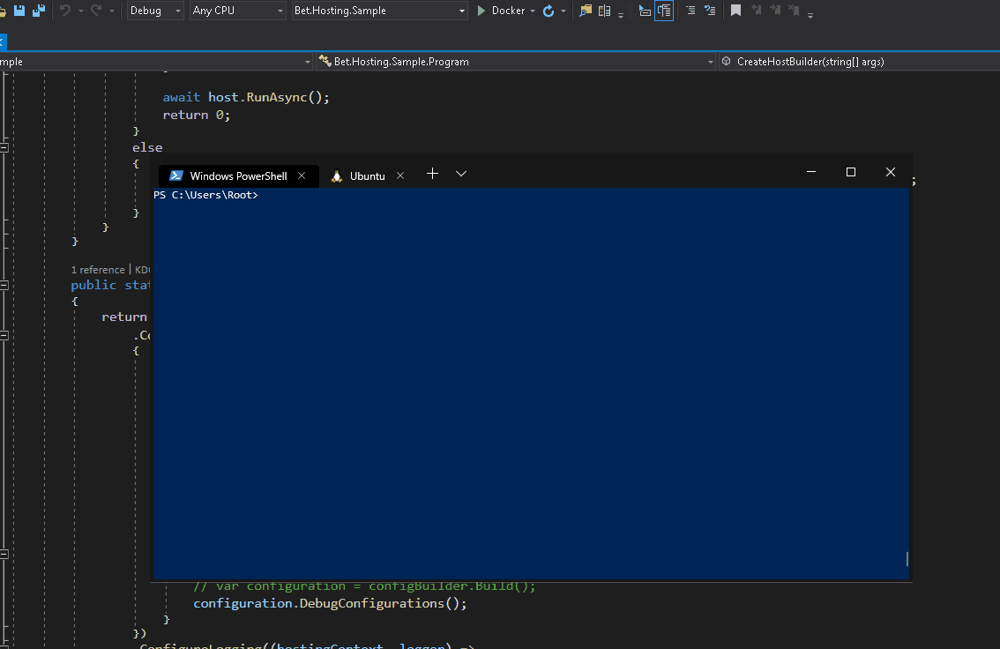

# AppAuthentication DotNetCore Cli Tool

[](https://raw.githubusercontent.com/kdcllc/AppAuthentication/master/LICENSE)
[](https://ci.appveyor.com/project/kdcllc/appauthentication)
[](https://www.nuget.org/packages?q=appauthentication)

[](https://f.feedz.io/kdcllc/kdcllc/packages/AppAuthentication/latest/download)

_Note: Pre-release packages are distributed via [feedz.io](https://f.feedz.io/kdcllc/kdcllc/nuget/index.json)._

The primary goal for this dotnet cli tool was to provide a seamless development experience for `local Docker Container` that requires access to Azure Resources such as Azure Key Vault, Azure Blob Storage, Azure Database etc.

By default when Visual Studio.NET or VSCode is run, the token provides are utilized to provide underline libraries with tokens for authentication. In contrast that doesn't exist for local Docker Container.

Once the tool is run, User specific Environments are set for the following variables:

- `MSI_ENDPOINT` and `MSI_SECRET`
- `IDENTITY_ENDPOINT` and `IDENTITY_HEADER`

These values allow for simulation of Azure App Service MSI Managed Identity calls.

## Hire me

Please send [email](mailto:kingdavidconsulting@gmail.com) if you consider to **hire me**.

[](https://www.buymeacoffee.com/vyve0og)

## Give a Star! :star:

It supports the following authentication libraries:

1. [`Microsoft.Azure.Services.AppAuthentication`](https://docs.microsoft.com/en-us/dotnet/api/overview/azure/service-to-service-authentication)
2. [`Azure.Identity` a new standard library](https://azuresdkdocs.blob.core.windows.net/$web/dotnet/Azure.Identity/1.6.1/index.html)

The tool was tested on:

- On Windows 11 Machine with Azure Cli and Visual Studio.NET Token Providers.

- On Linux with Azure Cli only. Install Azure Cli `curl -sL https://aka.ms/InstallAzureCLIDeb | sudo bash`



## Install

```bash
    dotnet tool install --global appauthentication
```

## Usage local Docker with Azure CLI

1. In the terminal login to the Azure subscription:

   ```bash
       az login
       az account list
       az account set –subscription “YourSubscriptionName”
   ```

2. Next before starting any terminals or Development IDE please run this tool in command prompt
   ```bash
   appauthentication run
   ```
3. Verify that User Environment Variables are created `Get-ChildItem Env:` :

```bash
    IDENTITY_ENDPOINT              http://host.docker.internal:5050/oauth2/token
    IDENTITY_HEADER                199aef00-4bd2-441f-9139-9574d001fc89
    MSI_ENDPOINT                   http://host.docker.internal:5050/oauth2/token
    MSI_SECRET                     199aef00-4bd2-441f-9139-9574d001fc89
```

4. If the variables are displayed that you are ready for running the containers

## `Docker-Compose.yaml` to pass User Environment into container

1. Update `Docker-Compose.yml` to something like this;

```yml
version: "3.4"

# docker-compose -f "docker-compose.yaml" up -d --build
# docker-compose -f "docker-compose.yaml" up -d --no-recreate
services:
  bet.web:
    image: app:WorkerSample
    build:
      context: .
      dockerfile: src/WorkerSample/Dockerfile
    environment:
      - DOTNETCORE_ENVIRONMENT=Development
      - MSI_ENDPOINT=${MSI_ENDPOINT}
      - MSI_SECRET=${MSI_SECRET}
      - IDENTITY_ENDPOINT=${IDENTITY_ENDPOINT}
      - IDENTITY_HEADER=${IDENTITY_HEADER}
```

Please see sample project [`WorkerSample`](./src/WorkerSample)

## `appauthentication` Tools possible switches

- --authority:https://login.microsoftonline.com/{tenantId} or -a:https://login.microsoftonline.com/{tenantId}
- --verbose:debug
- --token-provider:AzureCli (default) or -t:AzureCli
- --token-provider:VisualStudio or -t:VisualStudio
- --environment:Production or -e:Development (used with Azure Vault values to be loaded into tooling)
- --resource:{scope} or -r:{scope}
- --port:1010 or -p:2323 (default: 5050)
- --config:file or -c:appsettings.config
- --fix or -f
- --local or -l (default Docker) - local overrides Visual Studio.NET token profiles with this tooling

## Testing `appauthentication` from cli command

```bash
    dotnet run -- run --verbose:debug --local
```

## Reference

- To learn how to use this tool in real life example refer to [K8.DotNetCore.Workshop](https://github.com/kdcllc/K8.DotNetCore.Workshop)

- [How to authenticate .NET apps to Azure services using the .NET Azure SDK](https://docs.microsoft.com/en-us/dotnet/azure/sdk/authentication?tabs=command-line)
- [How to find your Azure Active Directory tenant ID](https://docs.microsoft.com/en-us/azure/active-directory/fundamentals/active-directory-how-to-find-tenant)
